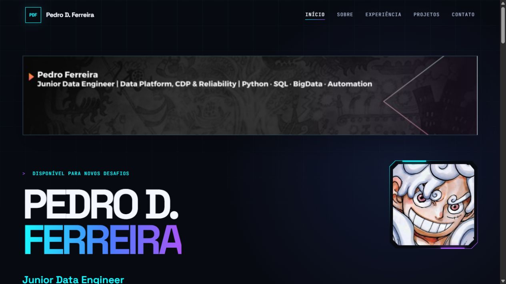

<p align="center">
  
</p>

---

<h1 align="center">DATA & CYBERSECURITY PORTFOLIO</h1>

###

<h3 align="left">ABOUT:</h3>

###

<p align="left">
  Personal portfolio and case study built with semantic HTML, modern CSS and vanilla JavaScript.<br><br>
  The project presents my work in Data Engineering, Analytics, BI, Data Operations and Cybersecurity. It documents selected projects, professional experience and current studies at Senac.<br><br>
  The interface uses a graphite cyberpunk visual system with restrained cyan and violet accents. The opening uses my LinkedIn banner and avatar. My original photo appears in the final contact section.<br><br>
  The goal is to keep the site fast, readable and easy to deploy without frameworks or runtime dependencies.
</p>

###

<h3 align="left">LANGUAGES AND TOOLS:</h3>

###

<div align="left">
  
  
  
  
  
  
  
  
  
</div>

###

<h3 align="left">FEATURES:</h3>

- Responsive desktop and mobile layouts
- Semantic navigation and accessible focus states
- Project showcase linked to source repositories
- LinkedIn, GitHub and WhatsApp contact paths
- Motion with reduced-motion support
- No frontend framework or package dependency
- One-page flow with anchor navigation and natural scrolling
- LinkedIn visual identity and original contact photo

###

<h3 align="left">PROJECT STRUCTURE:</h3>

```text
portfolio-pedro/
├── assets/
│   ├── linkedin-banner.jpg
│   ├── pedro-ferreira.jpg
│   ├── profile-avatar.png
│   └── portfolio-banner.png
├── .gitignore
├── index.html
├── script.js
└── styles.css
```

###

<h3 align="left">RUN LOCALLY:</h3>

```powershell
python -m http.server 4173
```

Open `http://localhost:4173` from the project directory.

###

<h3 align="left">SECURITY AND PRIVACY:</h3>

- No API keys, access tokens or passwords are required
- Local environment files and private key formats are ignored by Git
- The public WhatsApp link is intentional and used as the contact channel
- The LinkedIn banner, public avatar and contact photo are intentional public assets

###

<h3 align="left">CONTACT:</h3>

<p align="left">
  <a href="https://www.linkedin.com/in/data-pdf/">LinkedIn</a> ·
  <a href="https://github.com/DATAdotPDF">GitHub</a> ·
  <a href="https://api.whatsapp.com/send/?phone=5521964094297&text&type=phone_number&app_absent=0">WhatsApp</a>
</p>
